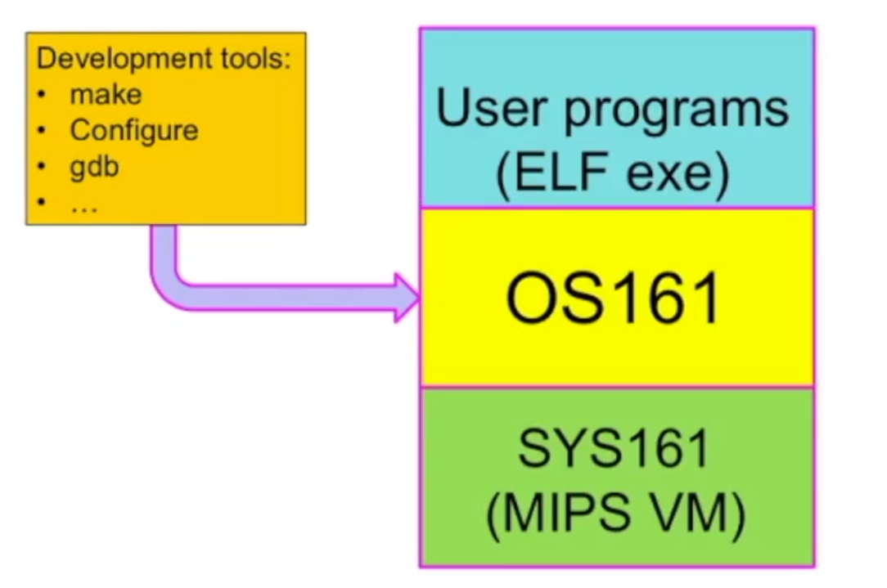

# Laboratorio 01

## Credenziali

Attenzione: Per l’intero sviluppo del corso le credenziali di accesso a comandi amministratore sono

`Username`: os161user

`Password`: os161user

## Introduzione a `Os161` [VIDEO 1: INTRO]

`Os161` è un sistema operativo didattico. Nel primo laboratorio, inizieremo a configurarlo, costruirlo e eseguirlo. È scritto in `C` (motivo per cui è necessario conoscere questo linguaggio). Si tratta di una versione semplificata di `UNIX` ed è un sistema completamente simulato che funziona su una macchina virtuale `MIPS` (una macchina virtuale semplice e non commerciale utilizzata a scopo didattico). Esistono due versioni di `os161`:

1. `1.x` - singolo processore
2. `2.x` - consente di simulare un `multiprocessore MIPS` e introduce diverse problematiche relative alla possibilità di implementare primitive di sincronizzazione.

`Os161` è un sistema realizzato in `macrokernel` (tutto in uno, non modulare).

Inizialmente, leggeremo il codice del sistema operativo e successivamente implementeremo le parti mancanti del kernel e faremo il debug guardando il kernel dall'interno.



L'architettura software in figura: `sys161` è un simulatore del `MIPS` sul quale si esegue un bootstrap del kernel di `os161` e sul kernel gireranno dei programmi utente in un formato di eseguibile che si chiama `ELF`.

Cose che dovremmo implementare nei laboratori:

- Locks.
- System calls.
- Virtual memory. Il "dumbvm" fornito con `OS161` è sufficiente per l'avvio e la realizzazione dei primi compiti. Non riutilizza mai la memoria e non può supportare grandi processi o `malloc`.
- File system.

### Primo Laboratorio

Il compito è semplice: dobbiamo vedere se riusciamo a compilare, linkare, visualizzare il `main` del kernel, modificarlo con istruzioni molto semplici ed eseguire in modalità debug il kernel.

`Os161` è pre-installato su una macchina virtuale pre-configurata.

Esploriamo due cartelle principali:

- `os161` che contiene i sorgenti
- `psd-os161/root` che contiene gli eseguibili

Proviamo un'esecuzione da terminale utilizzando `sys161 kernel`. In sostanza, apriamo un terminale, ci spostiamo in `os161/root` ed eseguiamo `sys161 kernel`. Questo avvia `os161` (ovvero esegue il bootstrap) e mostra un'interfaccia utente con un menu. Possiamo scrivere `?` per avere la lista dei comandi. Ad esempio, possiamo digitare `?t` per conoscere il menu dei test o `tt1` (che esploreremo in un laboratorio futuro). Alla fine, possiamo digitare `quit` per terminare l'esecuzione del kernel.

### Modalità Debug

Esaminiamo ora come eseguire in modalità debugger. Utilizziamo `sys161 -w kernel`. `sys161` è un eseguibile che simula la macchina `MIPS` e non ha bisogno di essere debuggato. Effettivamente, è un layer di traduzione dato che il nostro processore è tendenzialmente `Intel` o `AMD` e ci serviamo di `sys161` per tradurre l'assembly per il `MIPS`. Pertanto, non possiamo semplicemente debuggare `sys161`, bensì dobbiamo debuggare ciò che `sys161` esegue! Quindi, non dobbiamo debuggare il comando che lanciamo da terminale e dobbiamo usare un comando a parte. Lanciamo `sys161` in modalità ascolto (è stato scritto tenendo conto che potrebbe essere necessario monitorare l'esecuzione) su un socket che da un'altra finestra viene monitorato da un programma di debug chiamato `mips-harvard-os161-gdb`, che deve essere in ascolto su questo socket.

---

## Generazione kernel [VIDEO 2: BUILD]


Nell'immagine fornita nel testo si mostra come fare la build del codice kernel. Iniziamo dando un'occhiata alla prima parte, il `configure`.

Ci spostiamo nel percorso `/os161/os161-base*/kern/conf` dove troviamo vari file. Il file `conf.kern` è particolarmente importante dato che contiene definizioni di dispositivi attive, contrassegnate da `defdevice`. Inoltre, ci sono degli `include` di `arch/…` che sono altri file di configurazione strettamente legati alla piattaforma hardware e infine ci sono elenchi di file per compilare il kernel. In sostanza, troviamo anche `defoption` dove ci sono diverse configurazioni opzionali.

Facciamo un esperimento: eseguiamo `cp DUMBVM HELLO` e poi `./config HELLO`. Ciò che accade è che si crea una nuova versione del sistema operativo che si chiama `HELLO`. Per completare la compilazione, dobbiamo spostarci in `/os161/os161-base*/kern/compile/HELLO` e inserire il comando `bmake depend`. Questo aggiunge una cartella chiamata `includelinks` dentro la cartella `HELLO` che contiene una serie di `.h`. Questi sono riferimenti ai `.h` presenti nel sistema operativo e servono per compilare il kernel. Ora eseguiamo `bmake` per generare un nuovo kernel. Infine, con `bmake install` trasferiamo il kernel in `/os161/root` e troviamo il file `kernel-HELLO`.

### Modificare il Kernel

Vogliamo fare un'aggiunta molto semplice: un `kprintf()`. Per farlo, dobbiamo generare un file `hello.c`. Ci muoviamo in `os161-base/kern/main` e copiamo il `main.c` e lo rinominiamo `hello.c`. Lo apriamo con `emacs` (un programma di editing del testo). Nel codice, cancelliamo tutto tranne gli `include` e inseriamo:

```c
void hello(void) {
  kprintf(”Hello OS161\\n”);
}
```

Ora, vogliamo poter chiamare questa funzione in `main.c`. Nella funzione `kmain(char *arguments)`, dopo il `boot();`, inseriamo `hello();`. Per rendere visibile la funzione `hello` definita in `hello.c` nel `main.c`, potremmo inserire il corpo della funzione direttamente nel `main.c`.


Tuttavia, questa soluzione non è molto in linea con la programmazione modulare del C che prevede l'uso di file header. Per farlo, andiamo in `/kern/include` e creiamo un `hello.h` e scriviamo il prototipo della funzione:

```c
void hello(void);
```

Ora, aggiungiamo ai due file `hello.c` e `main.c` `#include “hello.h”`. Torniamo in `/kern/conf`, apriamo `HELLO` e alla fine scriviamo `options hello`, ma `option hello` deve ancora essere definita. Ci spostiamo nel file `conf.kernel` e scriviamo alla fine:

```c
	#NEW PDS WORK
defoption hello
optfile hello main/hello.c
```

---

## GBD: Uso del Debugger [VIDEO 3: GDB]

Esistono diverse modalità per utilizzare il debugger nel contesto di `os161`. Ecco alcuni metodi illustrati:

### Debugger In Linea

Per utilizzare il debugger in linea, sono necessari due terminali aperti nel percorso `os161/root`. Nel primo terminale, eseguire `sys161 -w kernel` per mettersi in attesa su un socket. Nel secondo terminale, eseguire `mips-harvard-os161-gdb kernel`. Questo metodo non fornisce una navigazione automatica ed è meno consigliato.

### Tui

Per utilizzare Tui, eseguire `mips-harvard-os161-gdb -tui kernel` nel secondo terminale. Questo comando intercetta l'esecuzione del main del kernel. Si possono eseguire due comandi per agganciare il kernel, visualizzare il sorgente del kernel e agganciare il socket. Questi comandi sono già preparati nel file `.gdbinit` nel percorso `os161/root`. Quindi, ogni volta che si rilancia il comando `sys161 -w kernel` nel primo terminale, si deve eseguire `dbos161` nel secondo terminale. Per interrompere l'esecuzione al main del kernel, si può scrivere `break kmain` e poi `c`. Tuttavia, questa modalità del debugger non è molto consigliata.

### DDD (Interfaccia verso GDB)

Per utilizzare DDD, eseguire `ddd --debugger -mips-harvard-os161-gdb kernel` sul secondo terminale. Questo comando apre una finestra del debugger. Nella parte inferiore della finestra, si trova un terminale gdb dove si possono eseguire i comandi gdb.


### Emacs

Per utilizzare Emacs, bisogna avviare l'editor Emacs e poi agganciare il debugger gdb. Nel secondo terminale, eseguire `emacs -rv` o `emacs`. È consigliato eseguire Emacs con finestra sganciata dal terminale, in modo da lasciare il terminale libero. Per fare ciò, si può aggiungere `&` alla fine del comando, ad esempio `emacs &`. Successivamente, si può andare su `Tool→Debugger` e inserire `mips-harvard-os161-gdb -i=mi kernel`.

### Modifica del Kernel


Per modificare il kernel, si può copiare il file `DUMBVM` e rinominarlo `HELLO`. Successivamente, bisogna generare un makefile e far girare il makefile per produrre il kernel. Questo passaggio è necessario per fare la build, ovvero per compilare, linkare ed agganciare le librerie. Il comando `make depend` e `bmake` (depend, compile/link, fixerrors) viene utilizzato per fare la build, mentre `bmake install` serve per installare il kernel. Infine, nel resto del video, il professore ripercorre l’esecuzione dei comandi spiegati esattamente come avviene in [[VIDEO 2]](lab01.md)

---

## Esecuzione di thread [VIDEO 4: THREAD]

Per esaminare l'esecuzione del codice `tt1`, utilizziamo il debugger. Le funzioni `thread_create`, `thread_fork` e `thread_yield` sono punti notevoli per impostare dei breakpoint.

Il professore ha già predisposto un branch del sistema operativo denominato `threads`. Questo non è altro che una copia di `HELLO`. Questa è una pratica consigliata: creare una copia ogni volta che si effettuano modifiche, per evitare problemi. Inizialmente, nel percorso `/root`, eseguiamo `os161 kernel` e notiamo che con `tt1` eseguiamo il test dei thread. Ora, per attaccare un debugger, lanciamo `sys161 -w kernel` e apriamo un secondo terminale dove attiviamo Emacs come debugger (seguendo i passaggi precedentemente descritti) con il comando `emacs rv&`. Ricorda di lanciare il debugger nella stessa cartella, ovvero `/root`, altrimenti non si aggancerà a `sys161`.

Nel caso in cui l'esecuzione vada in crash o si interrompa (esecuzione del primo terminale), possiamo evitare di far ripartire da zero Emacs. Invece, possiamo andare in `/.gdbinit` dove il professore ha inserito alcuni comandi:


Questi comandi inseriscono simboli diversi per ogni versione del sistema operativo di interesse. Attenzione: nonostante abbiamo definito più simboli, dobbiamo eseguirne solo uno (nell'immagine di esempio eseguiamo solo `dbos161t`). Una volta compreso questo, chiudiamo il file e eseguiamo `dbos161t`, impostiamo alcuni breakpoint con i comandi `b kmain`, `b thread_create`, `b thread_yield`, `b thread_fork`, `b thread_destroy` e poi lanciamo il comando `continue` per debuggare un po' il codice. Eseguendo `up` (UP stack), vediamo la funzione che chiama la funzione del breakpoint.

---

# [LAB IN PRESENZA] Configurazione del Kernel tramite Visual Studio Code

Il professore illustra come risolvere le problematiche utilizzando *Visual Studio Code* (VS Code). Per iniziare, è necessario aprire VS Code e selezionare `Terminal` → `Run Task`. A questo punto, dovrebbero comparire delle operazioni relative a `os161`. Se non si visualizzano, significa che l'ambiente non è correttamente collegato a `os161`. In tal caso, si dovrebbero utilizzare dei file JSON che, in teoria, sono già preinstallati nella VM del professore.

Nelle risorse del Laboratorio 1 è disponibile un file che mostra come configurare VS Code. Tuttavia, se si utilizza la VM del professore, non dovrebbero esserci problemi.

# Compilazione del Kernel tramite Visual Studio Code

Una volta configurato l'ambiente, il professore mostra come compilare il codice tramite VS Code. Occorre selezionare `Terminal` → `Run task` → `Run config` e inserire la versione che si desidera configurare. Nella cartella `os161-base-2.0.3` → `term` → `conf`, sono presenti 4 configurazioni/branch predefinite di `os161`: `DUMBVM` e `generic`.

Il professore sconsiglia l'utilizzo delle versioni OTP in quanto sono versioni ottimizzate e l'ottimizzatore potrebbe non mostrare le cose che ci si aspetta. Quindi, si consiglia di eseguire `Run task`, `Run config` e scrivere `DUMBVM`. Se tutto funziona correttamente, si può procedere con `Make Depend`.

Navigando, poi, nella cartella `/kern/compile`, si noteranno alcuni file `.h`, dei file `.c` e alcuni `Makefile`. Selezionando `Terminal` → `Run task` → `Make depend` → `Dumbvm`, si avviano alcune azioni che generano numerosi file `.c` in `/kern/compile/DUMBVM`. In sostanza, `Make Depend` genera un albero delle dipendenze che permette di ricompilare solo i file `.c` dei rispettivi `.h` che sono stati modificati.

Infine, esiste l'opzione `Build and Install` (in cui si scrive `DUMBVM`), che corrisponde a `bmake`. Se funziona correttamente, l'eseguibile viene copiato nella cartella di esecuzione, come avviene nei progetti professionali.

# Debug e Modifica del Kernel

Nella cartella `os161/root`, compaiono `kernel` e `kernel-DUMBVM`. Se si esegue solo `bmake` e non `bmake install`, significa che si è compilato e linkato il codice, ma non si sta eseguendo la nuova versione appena creata. Per risolvere questo problema, in VS Code, `Build and Install` sono combinati in un'unica opzione.

Per avviare il debugger, si può fare `Terminal` → `Run task` → `Run os161`, che attiva uno dei due lati della finestra di debug nella finestra del terminale. Successivamente, si può fare `Run` → `Start Debugging`. Il professore suggerisce di impostare dei breakpoint e di eseguire in modalità debug per verificare il corretto funzionamento.

Successivamente, il professore spiega come aggiungere nuove istruzioni e come abilitarle o disabilitarle. Ad esempio, si può aggiungere sotto `boot()` una `kprintf("HELLO\\n");`. Per compilarla, si può sfruttare `DUMBVM`. Quindi, si deve fare `Terminal` → `Run task` → `Build and Install` → scrivere `DUMBVM`. Successivamente, per eseguirlo, si può fare `Terminal` → `Run task` → `Run os161` e poi fare `Run` → `Start Debugging`. Se si esegue passo per passo, si può verificare che nel terminale sotto esegua la `kprintf` che è stata scritta.

Per rendere abilitabile o disabilitabile l'istruzione, si possono utilizzare gli switch di compilazione. Ad esempio:

```c
#if KERN_HELLO
kprintf("HELLO\\n");
#endif

```

Questo significa che se `KERN_HELLO` è definito (vero), allora usa questa istruzione, altrimenti non la usa.

Per poter usare `KERN_HELLO`, si deve definire all'inizio del file:

```c
#define KERN_HELLO 1

```

In questo caso, `KERN_HELLO` è abilitato di default. Se fosse stato impostato a zero, la nostra `kprintf` non avrebbe funzionato. Il problema è che per attivare o disabilitare la funzione, bisogna ricordarsi dove andare a modificare il file `.c`, cosa che può risultare scomoda.

Per risolvere questo problema, si può procedere in modo diverso, utilizzando dei simboli già definiti. Infatti, guardando in `/kern/compile/opt-dumbvm.h`, si scopre che è definito `#define OPT_DUMBVM 1`. Quindi, nel file principale, si può includere questo file con `#include “opt-dumbvm.h”` e, al posto di `KERN_HELLO`, si può scrivere `OPT_DUMBVM`.

A questo punto, si può provare a compilare con `Run task` → `Build and Install`, ecc. (qui, in teoria, sarebbe opportuno rigenerare il grado delle dipendenze).

Per disabilitare l'opzione, non si deve andare in `opt-dumbvm.h` e scrivere `0`, perché questo creerebbe problemi con le cose che vengono generate automaticamente. Al contrario, si deve modificare la generazione automatica. Quindi, si deve andare in `/kern/conf/DUMBVM` e cercare `options dumbvm`.

Se questa opzione esiste, allora il suo valore è `1`. Se la si commenta mettendo `#` prima di `option dumbvm`, allora si pone a zero il `define`. Se si ricompila e si va a vedere in `opt-dumbvm.h`, si vede che l'autogenerazione ora lo ha impostato a zero.

Il problema qui è che disabilitando `options dumbvm` si disabilita qualcosa che non serviva solo per abilitare o disabilitare la `kprintf`, creando quindi problemi. Per risolvere questo problema, è necessario creare una propria opzione di compilazione, diversa da `DUMBVM`.

Quindi, si deve decommentare `option dumbvm` (rimuovendo `#`), andare in `/kern/conf.kern` e aggiungere:

```c
defoption hello

```

Poi, si salva e si esce.

A questo punto, si può eseguire `Run task` → `Run config` e scrivere `DUMBVM`. Se si va in `/os161-base/kern/compile/opt-hello.h`, si vede che ora è definito `#define OPT_HELLO 0`. Quindi, se si va in `DUMBVM` e si aggiunge `option hello`, `OPT_HELLO` viene automaticamente impostato a `1`.

Quindi, prima di `kprintf`, si può usare:

```c
#if OPT_HELLO
kprintf
#endif

```

A questo punto, conviene creare una propria versione del sistema operativo, lasciando inalterata la versione `DUMBVM`. In sostanza, si desidera generare un branch che si chiama `HELLO`. Quindi, si deve fare `Run task` →  `Copy Config` e inserire il nome `HELLO`.

D'ora in poi, dove prima si scriveva `DUMBVM`, si deve scrivere `HELLO`. Infatti, in `/os161-base/compile` si trova anche il file `HELLO`. Se si va in `/os161/root`, si trova `kernel-HELLO` e `kernel`, che è un collegamento simbolico che ora punta a `kernel-HELLO`. Infatti, se si esegue ora `sys161 kernel`, si avvia la versione `HELLO` del kernel.

# Creazione di una Nuova Funzione in C

Ora, si inizia a lavorare in C. Si può creare la funzione `hello();` nel seguente modo:

```c
boot();

#if OPT_HELLO
hello();
#endif

```

Per generare un proprio file, si può copiare `main.c` da `os161-base/main` e rinominarlo `hello.c`, cancellando tutto tranne gli `include`. In `hello.c`, si può definire una nuova funzione:

```c
void hello(void) {
  kprintf("HELLO 2\\n");
}

```

A questo punto, si può fare `Terminal` → `Build and Install` → `HELLO` e si ottiene un errore che indica che in `main.c` c'è una dichiarazione implicita. Il problema è che qualsiasi funzione si chiama, non c'è scritto il prototipo sopra. Se si scrive il prototipo, si ottiene un "undefined reference". Questo è un errore non di compilazione, ma di linking, ovvero non ha inserito in compilazione `hello.c`. Quindi, bisogna scrivere il prototipo nel file.

Per risolvere questo problema, si va in `/conf.kern` e dopo `defoption hello` si scrive:

```c
file main/hello.c

```

Poi, si esegue nuovamente `make depend` e poi `build and install` e dovrebbe funzionare!

Tuttavia, si ottiene un errore. Anche in `hello.c`, bisogna inserire il prototipo prima della funzione:

```c
void hello(void);

```

Se si ricompila ora, la compilazione procede senza errori. Quindi, si può eseguire `sys161 kernel`.

Tuttavia, non è comodo dover gestire tutti i prototipi nei file `.c`. Quindi, bisogna crearsi i file `.h`. Si può generare il file `.h` in `/kern/include` copiando un file qualunque e rinominandolo `hello.h`. A questo punto, si apre `hello.h` e si cancella tutto, sostituendolo con:

```c
#ifndef HELLO_H
#define HELLO_H

void hello(void);

#endif

```

In questo modo, si collega il modulo in `hello.c`, rimuovendo il prototipo e inserendo `#include "hello.h"`. Si deve fare lo stesso anche in `main.c`.

A questo punto, si può ricompilare a partire da `make depend`.

Se si va in `kern/conf/hello` e si disabilita `options hello`, si salva e si rigira la configurazione. Così facendo, si disabilita la chiamata, ma la funzione è ancora presente. Come si può rimuovere la funzione dal kernel se non è abilitata?

Per risolvere questo problema, si va in `conf.kern` e invece di scrivere:

```c
file main/hello.c

```

si scrive:

```c
optfile hello main/hello.c

```

In questo modo, il file diventa opzionale e viene preso in considerazione solo se definito. In questo modo, si alleggerisce il kernel.

---

## Creazione dei Thread

Per iniziare, creiamo una nuova configurazione per il nostro sistema operativo. Utilizziamo la funzione 'Copia Configurazione' e la rinominiamo `THREADS`. Non apportiamo alcuna modifica a questa configurazione. Successivamente, eseguiamo `RUN CONFIG` e scriviamo `THREADS`, seguito da `make depend`. Infine, eseguiamo `Build and Install`. Ora, possiamo osservare come vengono generati i thread e come effettuare il debug su di essi.

Per avviare il processo, eseguiamo `run os161` e avviamo la modalità di debug. Proseguiamo con il comando `step into` nella funzione `menu(argoments)`. Arriviamo quindi a `kgets`. Ora, sul terminale, proviamo a scrivere `tt1`. Se posizioniamo il mouse sopra `buf`, vediamo che esso contiene `tt1`. Possiamo anche aggiungere `buf` alla sezione "watch" della colonna a destra in VS Code. In alternativa, possiamo andare nella console di debug di VS Code e digitare `-exec print buf` (questi sono i comandi di GDB preceduti da `-exec`).

Continuiamo con il debug fino a `cmd_dispatch`, la funzione che esegue il comando, e eseguiamo `step into`. Posizioniamo un breakpoint su `gettime(&before)`. Vediamo `.func(…)`, che è un puntatore a funzione, e facciamo `step into`. Dovrebbe apparire `threadtest` che inizializza un semaforo e avvia `runthreads`. Facciamo `step into` su quest'ultima.

Posizioniamo un breakpoint sull'ultimo `for` e vi saltiamo sopra. Se eseguiamo il debug passo a passo, vediamo che ci sono delle stampe. Da notare che ad uno step di un thread potrebbero corrispondere n step di altri thread. In sostanza, quando si utilizza il debugger passo a passo su un thread, perdiamo il controllo degli step degli altri thread.

Per debuggare un altro thread, dobbiamo interrompere il debugger e farlo ripartire con `Run Os161` e poi `Run → Start Debugging`. In seguito, posizioniamo un breakpoint su `runthreads` tramite la finestra a destra di VS Code e avviamo l'esecuzione fino a quando non raggiungiamo `runthreads`. Infine, posizioniamo un breakpoint su `loudthread` (ovvero la funzione che viene chiamata) sempre tramite la GUI di VS Code a destra. Vediamo che si stampa `120`, il proprio numero di thread. Se proviamo ad andare avanti passo a passo, l'esecuzione si interrompe ad ogni thread che chiama questa funzione. Se, invece, vogliamo seguire la vita di un solo thread, ??????
